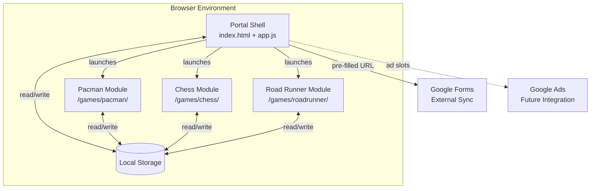
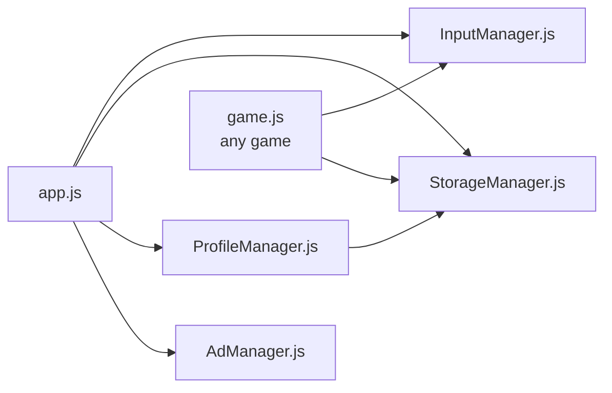
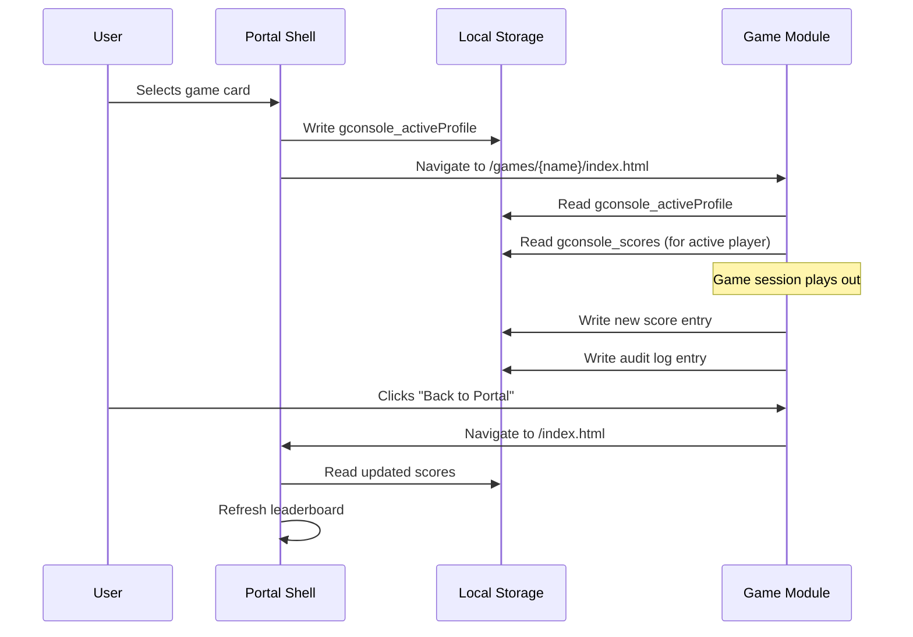
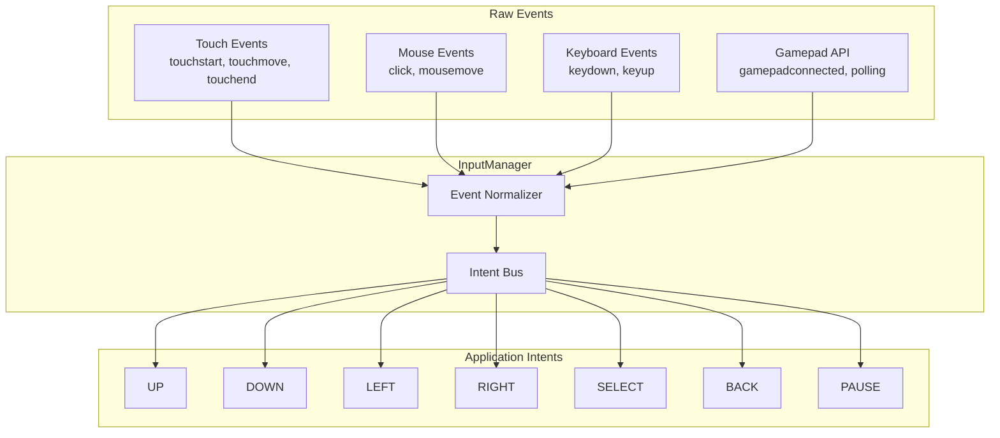
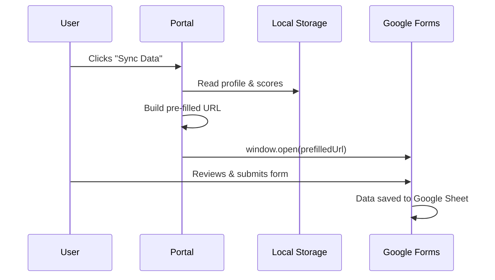

# Technical Design Document — GConsole Game Portal

## 1. Architecture Overview

GConsole is a purely static web application with no backend server. All state is managed in the browser via Local Storage. External sync is achieved through Google Forms pre-filled URLs.

---

## 2. System Context Diagram



---

## 3. Module Dependency Diagram



---

## 4. Component Architecture

### 4.1 Portal Shell (`index.html` + `app.js`)

The portal shell is the single landing page. It:
- Initializes all core managers
- Renders the game selection grid from a registry
- Displays the active player profile
- Manages modals for profile switching and leaderboards
- Injects ad placeholders via `AdManager`

### 4.2 Core Modules (`/js/core/`)

| Module | Responsibility |
|---|---|
| `InputManager.js` | Normalizes Touch, Mouse, Keyboard, Gamepad into intents |
| `StorageManager.js` | CRUD wrapper for Local Storage with JSON serde |
| `ProfileManager.js` | Player CRUD, active player switching, leaderboard calculation |
| `AdManager.js` | Viewport-aware ad placeholder injection |

### 4.3 Game Modules (`/games/{name}/`)

Each game is a self-contained directory with its own `index.html`, `game.js`, and `style.css`. Games communicate with the portal through **shared Local Storage keys**.

---

## 5. State Sharing Between Portal and Games



**Key Design Decision:** We use Local Storage as the shared state bus rather than URL parameters. This avoids URL length limits and keeps state persistent across sessions. The `gconsole_activeProfile` key always holds the current player ID.

---

## 6. Input Manager Architecture



---

## 7. Local Storage Schema

| Key | Type | Description |
|---|---|---|
| `gconsole_profiles` | `Array<Profile>` | All player profiles |
| `gconsole_activeProfile` | `string` | Active player ID |
| `gconsole_scores` | `Array<ScoreEntry>` | All score records |
| `gconsole_audit` | `Array<AuditEntry>` | User action audit log |

---

## 8. Responsive Breakpoints

```css
/* Mobile-first approach */
/* Small:    < 600px   — 1 column  */
/* Medium:  600–1024px — 2 columns */
/* Large:  1024–1440px — 3 columns */
/* XLarge:  > 1440px   — 4 columns */
```

---

## 9. Google Forms Integration Flow



The pre-filled URL format:
```
https://docs.google.com/forms/d/e/{FORM_ID}/viewform?usp=pp_url
  &entry.FIELD1={playerName}
  &entry.FIELD2={playerId}
  &entry.FIELD3={scoresJSON}
  &entry.FIELD4={auditJSON}
```

---

## 10. Testing Strategy

### 10.1 Cross-Device Testing Matrix

| Device Category | Browsers | Resolutions |
|---|---|---|
| Mobile | Chrome Android, Safari iOS | 360×640, 390×844, 414×896 |
| Tablet | Chrome, Safari | 768×1024, 800×1280 |
| Desktop | Chrome, Firefox, Edge | 1366×768, 1920×1080 |
| TV/Console | Chrome, Edge | 1920×1080, 3840×2160 |

### 10.2 Multi-Modal Input Test Cases

| Test ID | Input | Action | Expected Result |
|---|---|---|---|
| INP-01 | Touch tap on game card | SELECT intent | Game launches |
| INP-02 | Mouse click on game card | SELECT intent | Game launches |
| INP-03 | Keyboard Enter on focused card | SELECT intent | Game launches |
| INP-04 | Gamepad A button on focused card | SELECT intent | Game launches |
| INP-05 | Swipe left/right | Navigation | Game card focus moves |
| INP-06 | Keyboard arrow keys | Navigation | Game card focus moves |
| INP-07 | Gamepad D-pad | Navigation | Game card focus moves |
| INP-08 | Keyboard Escape | BACK intent | Modal closes / navigate back |
| INP-09 | Gamepad B button | BACK intent | Modal closes / navigate back |

### 10.3 Storage Persistence Tests

| Test ID | Scenario | Expected Result |
|---|---|---|
| STO-01 | Create profile, refresh page | Profile persists |
| STO-02 | Play game, record score, navigate back | Score visible on landing page |
| STO-03 | Switch profile, view leaderboard | Correct scores displayed |
| STO-04 | Clear browser data | Graceful empty state shown |
| STO-05 | Local Storage full | Error handled with user notification |

### 10.4 Responsive Layout Tests

| Test ID | Breakpoint | Expected Layout |
|---|---|---|
| RES-01 | < 600px | Single column, stacked cards, bottom ad banner |
| RES-02 | 600–1024px | 2-column grid, touch-friendly spacing |
| RES-03 | 1024–1440px | 3-column grid, sidebar ads visible |
| RES-04 | > 1440px | 4-column grid, overscan-safe margins |

### 10.5 Ad Placeholder Tests

| Test ID | Scenario | Expected Result |
|---|---|---|
| AD-01 | Mobile viewport | 1 banner placeholder rendered |
| AD-02 | Desktop viewport | 1 banner + 2 sidebar placeholders rendered |
| AD-03 | Viewport resize | Ad slots recalculated dynamically |
